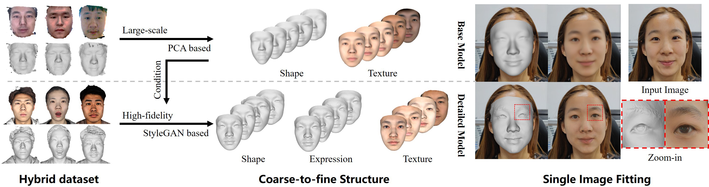
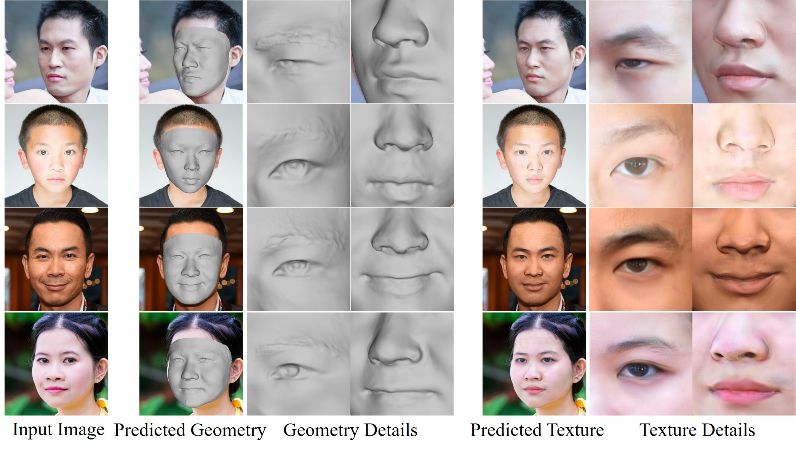
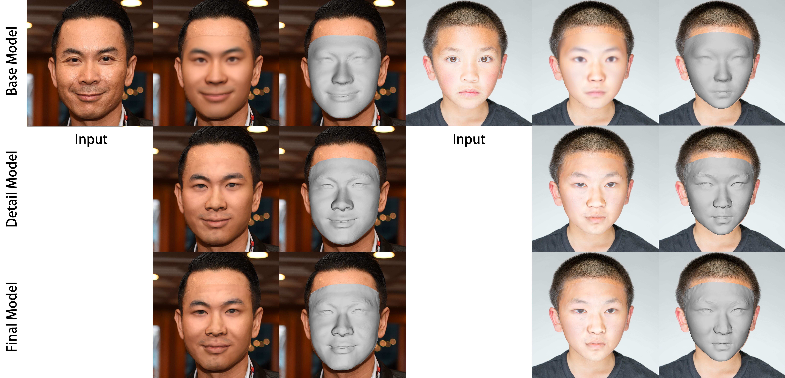

# FaceVerse
## FaceVerse: a Fine-grained and Detail-controllable 3D Face Morphable Model from a Hybrid Dataset
[Lizhen Wang](https://lizhenwangt.github.io/), Zhiyuan Chen, Tao Yu, Chenguang Ma, Liang Li, [Yebin Liu](http://www.liuyebin.com/)  CVPR 2022

Tsinghua University & Ant Group

[[Dataset]](https://github.com/LizhenWangT/FaceVerse-Dataset) [[Project Page]](http://www.liuyebin.com/faceverse/faceverse.html)



### Abstract
>We present FaceVerse, a fine-grained 3D Neural Face Model, which is built from hybrid East Asian face datasets containing 60K fused RGB-D images and 2K high-fidelity 3D head scan models. A novel coarse-to-fine structure is proposed to take better advantage of our hybrid dataset. In the coarse module, we generate a base parametric model from large-scale RGB-D images, which is able to predict accurate rough 3D face models in different genders, ages, etc. Then in the fine module, a conditional StyleGAN architecture trained with high-fidelity scan models is introduced to enrich elaborate facial geometric and texture details. Note that different from previous methods, our base and detailed modules are both changeable, which enables an innovative application of adjusting both the basic attributes and the facial details of 3D face models. Furthermore, we propose a single-image fitting framework based on differentiable rendering. Rich experiments show that our method outperforms the state-of-the-art methods.


**Fig.1** Single-image fitting results using FaceVerse model.

## FaceVerse PCA model and pre-trained checkpoints
Please download the zip file of **version 0** or **version 1** (recommended) and unzip it in the `./data` folder.

**FaceVerse version 0** [[download]](https://drive.google.com/file/d/1V80ntpWj1BJb7jriWR2ipdcSQIFTHOwv/view?usp=sharing): paper version.



**Fig.2** Single-image reconstruction results of version 0 (base model, detail model and expression refined final model).

**FaceVerse version 1** [[download]](https://drive.google.com/file/d/1CWnZMxI_lH9lPo-_hbRvgM6b-KfSRtFJ/view?usp=sharing):

- Refine the shape of the base PCA model: symmetrical and more detailed.

- Remove the points inside the mouth.

- Refine the expression PCA components.


**Fig.3** Single-image reconstruction results of **version 1** (base model, detail model and expression refined final model).

**FaceVerse version 2** [[download]](https://drive.google.com/file/d/1_ooP9hvR7kUUO8WhtXRU_D4nM5fr8BT_/view?usp=sharing) (only the PCA base model for video tracking, please use version 1 for image fitting):

- Fit the expression components to the 52 blendshapes defined by Apple. Please check 'exp_name_list' in faceverse_simple_v2.npy for the mapping relation.

- Provide a simplification option (normal with 28632 vertices, simplified with 6335 vertices): you can use the selected points of FaceVerse v2 by:

```
python tracking_online.py  --version 2 --use_simplification
python tracking_offline.py --input example/videos/test.mp4 --res_folder example/video_results --version 2 --use_simplification
```

- Refine the shape of the base PCA model: orthogonalization.


**Fig.4** Real-time online tracking results (30 fps) of **version 2**. The real-time version is accelerated by point-base rendering using cuda (this version has not been released).

## Requirements

- Python 3.9
- PyTorch 1.11.0
- torchvision 0.11.1
- PyTorch3D 0.6.0 
- Cuda 11.3
- ONNX Runtime
- OpenCV
- Numpy
- tqdm
- ninja

You need to compile the ops provided by [stylegan2-pytorch](https://github.com/rosinality/stylegan2-pytorch) using ninja:

```
cd third_libs/stylegan_ops
python3 setup.py install
```


## Single-image fitting
Reconstructing a 3D face from a single image. There are three processes: 
(a) reconstructed by PCA model; (b) refined by the detailed generator; (c) refined by the expression generator.

An example input with a image folder (sampled from the [FFHQ](https://github.com/NVlabs/ffhq-dataset) dataset):

```
python3 fit_images.py --version 1 --input example/images --res_folder example/image_results --save_ply
```

Note: the detailed refinement is based on differentiable rendering, which is quite time-consuming (over 10 minutes).


## Video-based tracking using our PCA base model


Offline tracking input with a video (our code will crop the face region using the first frame, --use_simplification can be only used for version >= 2):

```
python tracking_offline.py --input example/videos/test.mp4 --res_folder example/video_results --version 2
```


Online tracking using your PC camera (our code will crop the face region using the first frame, --use_simplification can be only used for version >= 2):

```
python tracking_online.py  --version 2
```


Note: the tracking is based on differentiable rendering and only has 2 fps.

## Citation
If you use this dataset for your research, please consider citing:
```
@InProceedings{wang2022faceverse,
title={FaceVerse: a Fine-grained and Detail-controllable 3D Face Morphable Model from a Hybrid Dataset},
author={Wang, Lizhen and Chen, Zhiyua and Yu, Tao and Ma, Chenguang and Li, Liang and Liu, Yebin},
booktitle={IEEE Conference on Computer Vision and Pattern Recognition (CVPR2022)},
month={June},
year={2022},
}
```

## Contact
- Lizhen Wang [(wlz18@mails.tsinghua.edu.cn)](wlz18@mails.tsinghua.edu.cn)
- Zhiyuan Chen [(juzhen.czy@antfin.com)](juzhen.czy@antfin.com)
- Yebin Liu [(liuyebin@mail.tsinghua.edu.cn)](mailto:liuyebin@mail.tsinghua.edu.cn)

## Acknowledgement & License
The code is partially borrowed from [3DMM-Fitting-Pytorch](https://github.com/ascust/3DMM-Fitting-Pytorch), [stylegan2-pytorch](https://github.com/rosinality/stylegan2-pytorch) and [OpenSeeFace](https://github.com/emilianavt/OpenSeeFace). And many thanks to the volunteers participated in data collection. 

